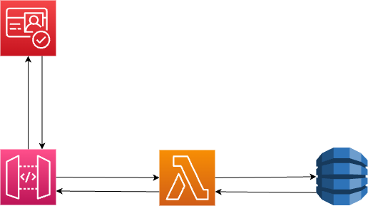

# 1. VS Code＋マークダウンでいろんな設定を使ってみた

VS Code＋マークダウンで綺麗なドキュメントを作りたい。試してみた。

- [1. VS Code＋マークダウンでいろんな設定を使ってみた](#1-vs-codeマークダウンでいろんな設定を使ってみた)
  - [1.1. 目次・ナンバリング機能](#11-目次ナンバリング機能)
  - [1.2. AWSのアーキテクチャ](#12-awsのアーキテクチャ)
  - [1.3. MkDocsを使ってみた](#13-mkdocsを使ってみた)
    - [1.3.1. リアルタイム編集](#131-リアルタイム編集)
    - [1.3.2. マテリアルデザイン](#132-マテリアルデザイン)
  - [1.4. PDF化](#14-pdf化)

## 1.1. 目次・ナンバリング機能

[目次の自動生成・更新も可能である。](https://qiita.com/eyuta/items/b1a53f3da8c5f8e7f41d#%E3%82%BB%E3%82%AF%E3%82%B7%E3%83%A7%E3%83%B3%E7%95%AA%E5%8F%B7%E3%81%AE%E8%BF%BD%E5%8A%A0%E5%89%8A%E9%99%A4)

## 1.2. AWSのアーキテクチャ

draw.ioを使って、以下の図をリアルタイム編集することができる。

## 1.3. MkDocsを使ってみた

MkDocsを使用するとHTMLページを生成することができる。使い方は[このページ](https://qiita.com/yagizo/items/fef66728f97b866a3bee)に記載。

### 1.3.1. リアルタイム編集

内部サーバーを起動して、リアルタイムでHTMLの編集ができる。index,mdがある場所で、以下コマンドを実行する。

~~~bash
mkdocs serve
~~~

### 1.3.2. マテリアルデザイン

[pythonパッケージを入れることでマテリアルデザインにも対応できる。](https://qiita.com/yagizo/items/fef66728f97b866a3bee)

## 1.4. PDF化

[拡張機能でPDF化が可能である。](https://qiita.com/P-man_Brown/items/93b156d47ee1887fb2b6)
